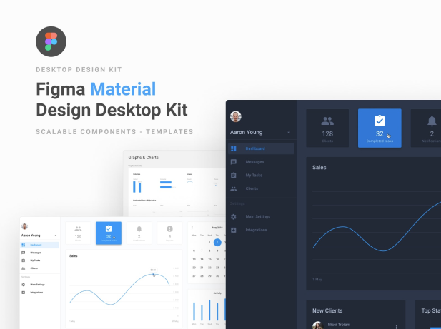
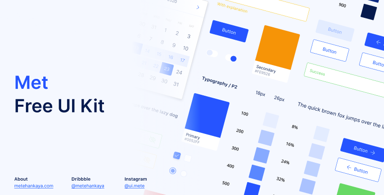

👏 👏 👏 Check out video about the library: [Fidget: Let's rethink UI development with Nim (NimConf 2020)](https://www.youtube.com/watch?v=IB8Yt2dqZbo) 👏 👏 👏

# Fidget - A cross platform UI library for nim

⚠️ WARNING: This library is still in heavy development. ⚠️

`nimble install fidget2`


[API reference](https://nimdocs.com/treeform/fidget2)

## About

Fidget aims to provide natively compiled cross platform UIs for any platform - Web with HTML5 (WASM), Windows, macOS, Linux, iOS and Android with OpenGL.

Fidget leverages [Figma](https://www.figma.com/) - an app that is taking the design world by storm. Fidget uses Figma API to load designs directly. No more counting pixels, no more CSS puzzles. Want to change some spaces? Change it in Figma, press F5 in your see the changes in real time!

## It allows you to create UIs like these:


## Simple Example Counter:


Figma file: https://www.figma.com/file/Km8Hvdw4wZwEk6L1bN4RLa

```nim
# Connect a figma file to the code base.
use("https://www.figma.com/file/Km8Hvdw4wZwEk6L1bN4RLa")

# This is where we store the count.
var count = 0

# On click of the button increment the counter.
onClick("Count1Up"): inc count

# When displaying text use the count variable.
onDisplay("text", $count)
```

## Getting the API key.

Before using the Figma API you will need a Figma account and the API key. After creating account go to your profile's settings, add new `Personal access token` and download your key and put it into `.figmakey` in your home directory or the root file of your project.


## Figma for Programmers

Figma is the fastest growing UI tool. Its demanded by almost all new UI job postings. Chances are your friendly UI designer knows of or users Figma.

If you don't know how to use Figma or how to do UI design I highly recommend giving Figma's YouTube channel a try: https://www.youtube.com/channel/UCQsVmhSa4X-G3lHlUtejzLA its full of great tutorials.

Figma also has a whole library of designs https://www.figma.com/community licensed under CC BY 4.0! Yes that means you can use these designs for free, by simply giving credit! Just duplicate them into your account, modify and remix them. The amount of high quality designs there can really boost any UI project!

"Let somebody else figure out how to make it look pretty, as long as you can move rectanges around you are good." - Ryan




