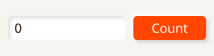
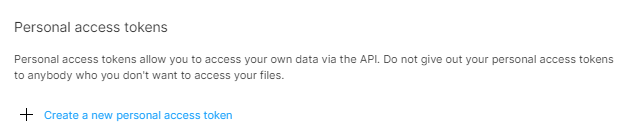

👏 Check out video about the library: [Fidget: Let's rethink UI development with Nim (NimConf 2020)](https://www.youtube.com/watch?v=IB8Yt2dqZbo) 👏 

# Fidget - A cross platform UI library for nim

⚠️ WARNING: This library is still in heavy development. ⚠️

`nimble install fidget2`


[API reference](https://treeform.github.io/fidget2)

## About

Fidget aims to provide natively compiled cross platform UIs for any platform - Web with HTML5 (WASM), Windows, macOS, Linux with OpenGL.

Fidget leverages [Figma](https://www.figma.com/) - an app that is taking the design world by storm. Fidget uses Figma API to load designs directly. No more counting pixels, no more CSS puzzles. Want to change some spaces? Change it in Figma, press F5 in your see the changes in real time!


## Examples:

See all of the examples in the
[example folder](https://github.com/treeform/fidget2/blob/master/examples/).

### Simple counter



Figma file: https://www.figma.com/file/Km8Hvdw4wZwEk6L1bN4RLa

```nim
var count = 0
find "/UI/CounterFrame":
  find "Count1Up":
    onClick:
      inc count
  find "CounterDisplay/text":
    onDisplay:
      thisNode.text = $count
```

### Calculator


[See the source code here](https://github.com/treeform/fidget2/blob/master/examples/calculator/calculator.nim)


### Nim Form

The style was copied form the current HTML forum, but nothing here uses HTML. Its all native rectangles, images and text.


[See the source code here](https://github.com/treeform/fidget2/blob/master/examples/nimforum/nimforum.nim)


## Getting the API key.

Before using the Fidget integrated Figma API you will need a Figma account and the API key. After creating account go to your profile's settings, add new `Personal access token` and download your key and put it into `.figmakey` in your home directory or the root file of your project.



## Figma for Programmers

Figma is the fastest growing UI tool. Its demanded by almost all new UI job postings. Chances are your friendly UI designer knows of or users Figma.

If you don't know how to use Figma or how to do UI design I highly recommend giving Figma's YouTube channel a try: https://www.youtube.com/channel/UCQsVmhSa4X-G3lHlUtejzLA its full of great tutorials.

Figma also has a whole library of designs https://www.figma.com/community licensed under CC BY 4.0! Yes that means you can use these designs for free, by simply giving credit! Just duplicate them into your account, modify and remix them. The amount of high quality designs there can really boost any UI project!

> "Let somebody else figure out how to make it look pretty, as long as you can move rectanges around you are good." - Ryan 

## Philosophy

As an industry we design too much of the UI by hand. And we do it many times. A designer builds the UI. We throw that away. Then programmers code up layouts, set colors, and push pixels around. Sometimes several different times for web and mobile.

It is madness!

Music is not coded by hand, we use tools. Images are not coded by hand, we use tools. Nor are 3D models, which can be very complex, with bones, sockets, and animations. They have editors and tools. Why do we do this for UI? Why has no good UI editor appeared?

It is madness!

This happens because of the wrong programming model. What you want is the design side and the action side. The design side is a tree of nodes made in a UX design program like Figma. The action side is also a tree of event handlers, display functions, and other mutators. A designer should be able to change the design a bit and it should stay working. Likewise a programmer should be able to change the handlers and the design should not need to change. You should be able to rig a UI design and puppet it from code.

You can start with design and make a very pretty UI, then attach code to it.
Or you can start with code and just have ugly boxes at first, then make a pretty design later. It is never this simple though. On any large project you go back and forth. The faster you can iterate with the two halves the better.

## Making an app

To open a window and start the app call `startFidget` with the figma file and other window properties.

```nim
startFidget(
  figmaUrl = "https://www.figma.com/file/Km8Hvdw4wZwEk6L1bN4RLa",
  windowTitle = "Temperature",
  entryFrame = "/UI/TemperatureFrame",
  windowStyle = Decorated
)
```

Then use `find` to build the event tree using glob patterns:

```nim
find "/UI/TemperatureFrame":
  find "CelsiusInput/text":
    onDisplay:
      ...
    onEdit:
      ...
    ofFocus:
      ...
    onUnfocus:
      ...
```

In every event hander you get `thisNode` and it has many properties:

```nim
thisNode.text = "hello world"
```


## Find and Glob Patters

* Absolute path from the mounted frame: `/UI/TemperatureFrame/...`
* Relative to the current `find` scope: `find "CelsiusInput/text"`
* Globs are supported: `find "**/Button*"` (descendants), `find "*/icon"` (children by name)

Find works both as top level thing: 

```nim
find "/UI/TemperatureFrame":
  find "CelsiusInput/text":
    ...
```

And as a function:

```nim
let nodeA = find("/UI/TemperatureFrame")
let nodeB = find("../bg")
```

And even as part of the node itself so that it only looks for chindren:

```nim
let subNode = node.find("text")
```

You can also use `finds` to find multiple nodes:
```nim
for button in finds("Button*"):
```

You can use `*` or `?` and even `**` to select multiple nodes at once:
```nim
find "Button?":
  # Selects all buttons: Button0 - Button9
  onClick:
    echo thisNode.name[^1]
```

## Event model

Attach any subset of these inside a `find` block:

* `onDisplay` - Runs during render when the node is painted. Use for idempotent view updates (for example, set text or value if not focused) **Best practice:** keep `onDisplay` cheap, prefer mutating only what actually changed.
* `onFocus` / `onUnfocus` - Focus or blur notifications for interactive nodes for when `thisNode.focused` changes.
* `onEdit` - Content changed (for example, text input keystrokes)
* `onShow` / `onHide` - Visibility toggles (when `thisNode.shown` changes)
* `onClick` - Mouse left click.
* `onClickOutside` - Useful to cancel actions.
* `onRightClick` - Mouse right click.
* `onMouseMove` - When mouse moves over the element.


## Node key properties and fields

`thisNode` is a `Node` that mirrors Figma’s model with extra runtime fields for interactivity, layout, and caching.

### Identity and type

* `id: string` - Stable unique id
* `name: string` - Node name from the design tool
* `kind: NodeKind` - One of `FrameNode`, `TextNode`, `RectangleNode`, etc
* `children: seq[Node]`, `parent: Node`
* `componentId: string`, `prototypeStartNodeID: string`

### Transform

* `position: Vec2` - Top left in parent coords
* `size: Vec2` - Width and height in px
* `scale: Vec2`, `rotation: float32`
* `flipHorizontal: bool`, `flipVertical: bool`

### Text

* `text: string` - Main way to get and set text.
* `style: TypeStyle` - Font family, size, weight, decoration, auto resize, etc
* `characterStyleOverrides: seq[int]`, `styleOverrideTable: Table[string, TypeStyle]`
* Helpers: `cursor: int`, `selector: int` (selection), `multiline`, `wordWrap`, `spans`, `arrangement`
* Undo or redo for text only: `undoStack`, `redoStack`

### Layout and constraints

* `constraints: LayoutConstraint` - (min, max, scale, stretch, center per axis)
* `layoutAlign: LayoutAlign`, `layoutMode: LayoutMode`
* `layoutGrids: seq[LayoutGrid]`
* `itemSpacing: float32`
* `counterAxisSizingMode: AxisSizingMode`
* Padding: `paddingLeft`, `paddingRight`, `paddingTop`, `paddingBottom`
* Overflow: `overflowDirection: OverflowDirection`

### Visuals and shape

* `fillGeometry: seq[Geometry]`
* `strokes: seq[Paint]`, `strokeWeight: float32`, `strokeAlign: StrokeAlign`
* `cornerRadius: float32`, `rectangleCornerRadii: array[4, float32]`
* `effects: seq[Effect]`, `blendMode: BlendMode`, `opacity: float32`, `visible: bool`
* Masking: `isMask`, `isMaskOutline`, `booleanOperation`, `clipsContent`

### Runtime and caching

* `dirty: bool` - Needs redraw
* `pixels: Image`, `pixelBox: Rect` - Render cache and bounds
* `editable: bool` - Whether the user can edit text
* `mat: Mat3` - World transform helper
* `collapse: bool` - Draw as a single texture (internal optimization)
* `frozen: bool`, `frozenId: string` - Snapshot linkage
* `shown: bool` - Visibility flag backing `onShow` or `onHide`
* Scrolling: `scrollable: bool`, `scrollPos: Vec2`
